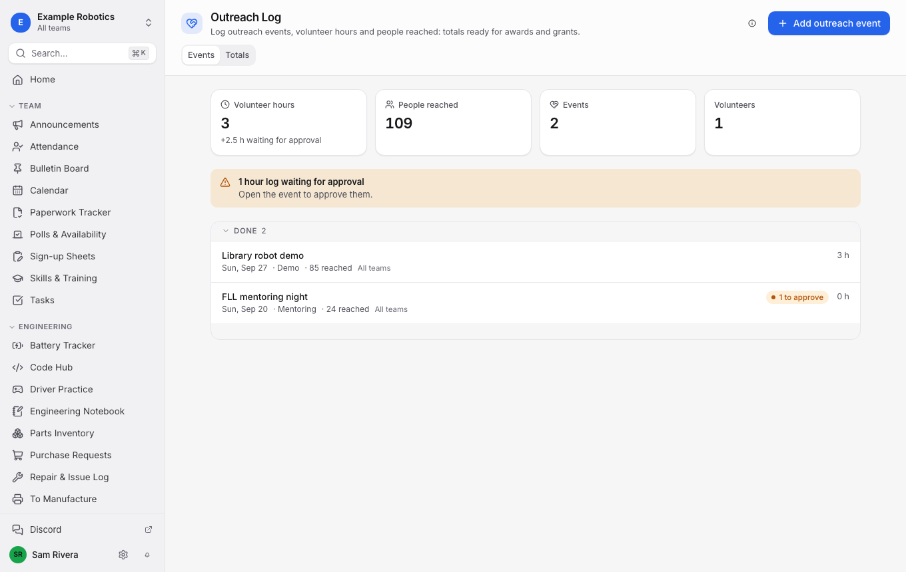
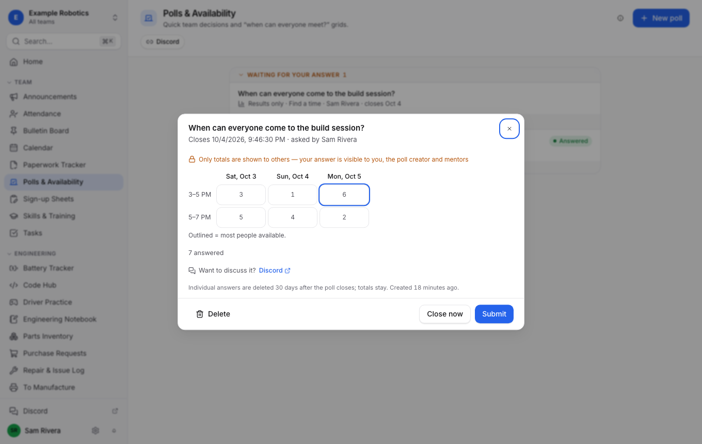
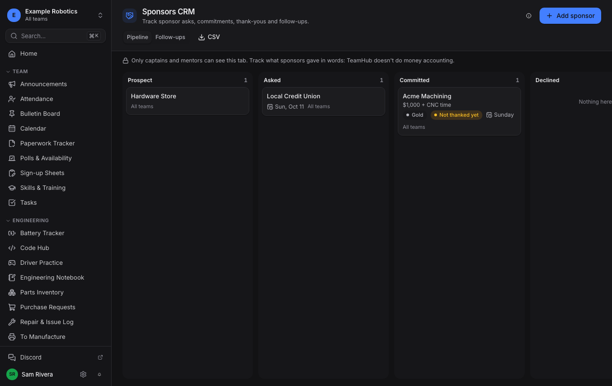

# TeamHub FTC

An open-source, bring-your-own-services team dashboard for *FIRST* Tech Challenge teams.

Created by [FTC Team 23208](https://ftcscout.org/teams/23208) (Eli Korpus) and shared free with every FTC team.

TeamHub gives your program one place for practices, tasks, the engineering notebook, scouting, competition day,
outreach hours and more, with only the tabs you choose. It runs on **your own** free Supabase project and **your
own** free static host, so there are no accounts with us, no fees and no data leaving your control.

- **Setup wizard** (`npm run setup`): a friendly local web app that collects your teams, colors, logos and tabs,
  builds your database for exactly those tabs, creates your admin account and walks you through hosting.
- **Dashboard**: a fast web app (works great on phones at competitions) built from your choices. Tabs you don't pick
  add zero bytes to the site and zero tables to the database.



| | |
|---|---|
|  |  |

## What's inside

28 optional tabs in four groups ([full list](docs/modules/README.md)):

| Team | Engineering | Competition | Outreach & Business |
|---|---|---|---|
| Calendar, Attendance, Announcements, Bulletin Board, Tasks, Polls & Availability, Sign-up Sheets, Skills & Training, Paperwork Tracker | Engineering Notebook, To Manufacture, Parts Inventory, Purchase Requests, Battery Tracker, Repair & Issue Log, Driver Practice, Code Hub | Events & Results, Competition Day, Scouting, Checklists, Judging Prep, Rules Reference | Outreach Log, Sponsors CRM, Media Gallery, Social Media Planner, Merch & Orders |

Plus the core every dashboard has: **Home** (your day at a glance), **People** (join requests and approval, positions,
"Request info" for things like shirt sizes) and **Admin** (storage meters, tool links, keep-alive).

Highlights:

- **Scouting without Google Forms.** Pick the competition and every team, ranking, match and award loads from
  FTCScout and refreshes live during the event. Your scouts fill in team-built pit and match forms on their phones,
  with a checklist showing which teams still need scouting, plus insights, comparisons and a pick list.
- **Multi-team programs.** One dashboard for teams A, B and C, with a team switcher and per-team colors.
- **Permissions that match real teams.** Members, captains and mentors, plus positions like "3D Print Farm Manager"
  or "Outreach Lead" that unlock exactly their part.
- **Built for the free tier.** Photos are compressed in the browser, old files are cleaned up automatically, and a
  full season with every tab uses about 5 MB of the 500 MB free database.
- **Safe for students.** No in-app chat or private messages (discussion links to your team's existing chat), private
  profile fields visible only to mentors, and every form says who will see your answer.

## Get started

You need a computer with [Node.js](https://nodejs.org) 20.19+ and Git, a GitHub account and a free
[Supabase](https://supabase.com) account. Setup takes about 30 minutes.

1. **Make your own copy on GitHub (a "fork").** Sign in to GitHub, open
   [github.com/elikorpus/teamhub-ftc](https://github.com/elikorpus/teamhub-ftc) and click **Fork** (top right).
   - **Owner:** your team's or school's GitHub organization if you have one, otherwise your own account.
   - **Repository name:** we suggest your team or organization name followed by `-teamhub`, for example
     `example-robotics-teamhub` or `team-23209-teamhub`. It keeps your copy easy to recognize.

   Then click **Create fork**. Your copy lives at `https://github.com/OWNER/REPOSITORY-NAME`.
2. **Download your copy to your computer** (use your fork's owner and name; the green **Code** button on your fork's
   page shows the exact link):

   ```sh
   git clone https://github.com/OWNER/REPOSITORY-NAME.git
   cd REPOSITORY-NAME
   ```

   For example: `git clone https://github.com/example-robotics/example-robotics-teamhub.git`.

3. **Install and start the setup wizard** (it opens http://localhost:4747 in your browser):

   ```sh
   npm install
   npm run setup
   ```

More detail, including naming, GitHub Desktop and team accounts: [Get your own copy](docs/setup-wizard.md#before-you-start-get-your-own-copy).


The wizard explains every step ([walkthrough](docs/setup-wizard.md)). When it's done, connect your fork to a host:
[Cloudflare](docs/hosting/cloudflare.md), [Vercel](docs/hosting/vercel.md), [Netlify](docs/hosting/netlify.md) or
[GitHub Pages](docs/hosting/github-pages.md).

Later, run `npm run setup` again to **edit** your dashboard (add tabs, rebrand, change permissions), **update** to a
new TeamHub version ([how updates work](docs/updating.md)), back up and restore, or start a **new season**.

## Customize it with AI

Want changes the wizard can't make? [`AGENTS.md`](AGENTS.md) explains the codebase and its safety rules to AI coding
assistants (Claude Code, Cursor, GitHub Copilot, Codex and others read it automatically). Your dashboard's
**Admin > AI assistant** page has a ready-to-paste prompt with your program's name and tabs filled in.

## Documentation

- [Setup wizard walkthrough](docs/setup-wizard.md)
- [Updating your dashboard](docs/updating.md)
- [Hosting guides](docs/hosting/README.md)
- [Tab library](docs/modules/README.md)
- [Configuration file reference](docs/configuration.md)
- [Testing](docs/testing.md)
- [Guide for AI coding assistants](AGENTS.md)
- [Contributing and writing a tab](CONTRIBUTING.md)
- [Releasing (maintainers)](docs/releasing.md) and [changelog](CHANGELOG.md)

## Try it locally

```sh
npm install
npm run dev:demo     # dashboard with every tab, using examples/demo.config.json
```

`dev:demo` needs a Supabase project to sign in. Point `examples/demo.config.json` at a throwaway project, or run the
mocked smoke tests: `npm run build:demo && npx playwright test`.

## Security

- Your Supabase **publishable** key and URL are public by design; row-level security in your database decides who
  can read and write what. Every tab ships with tests for those rules.
- The wizard uses your Supabase personal access token only on your computer (in memory, or in
  `~/.teamhub/credentials.json` if you choose "remember"). It's never committed or sent anywhere except Supabase.
- Found a security issue? Please report it privately; see [SECURITY.md](SECURITY.md).

## License

MIT. See [LICENSE](LICENSE). You're free to use, change and share TeamHub. The license asks one thing in return: keep
the copyright notice crediting FTC Team 23208 in your copy. Please also leave the small "made by FTC Team 23208" line
on the login page.
