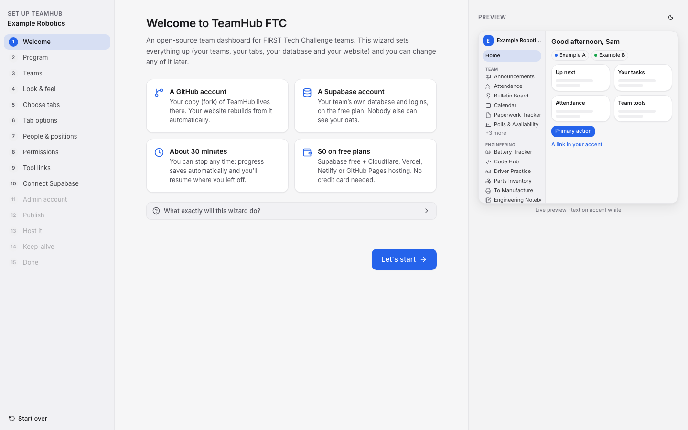
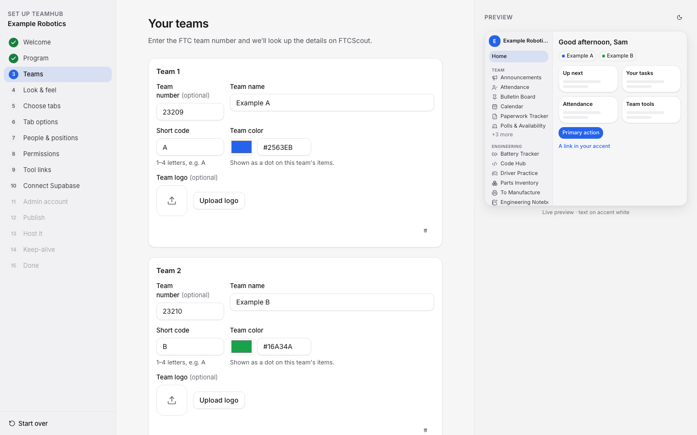
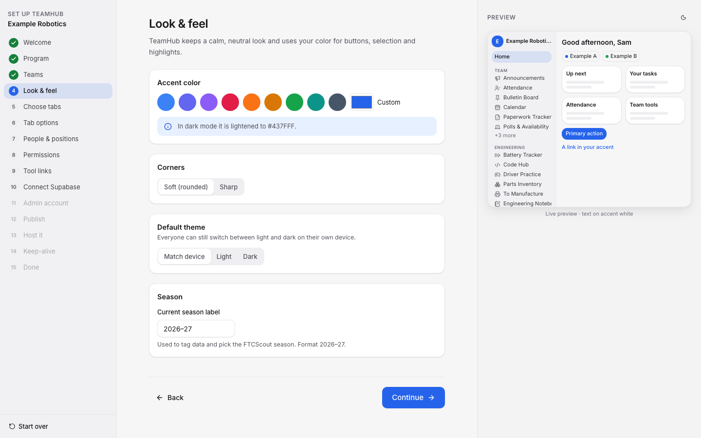
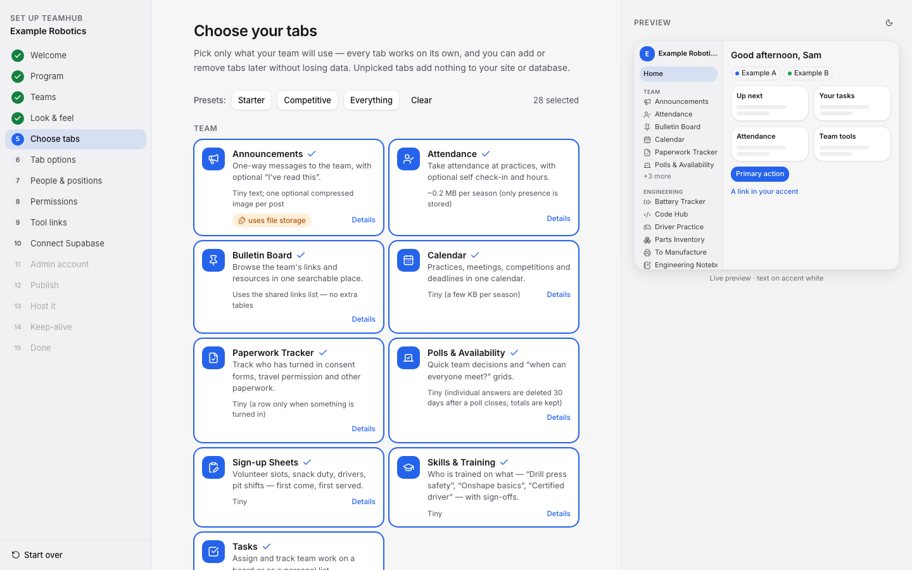
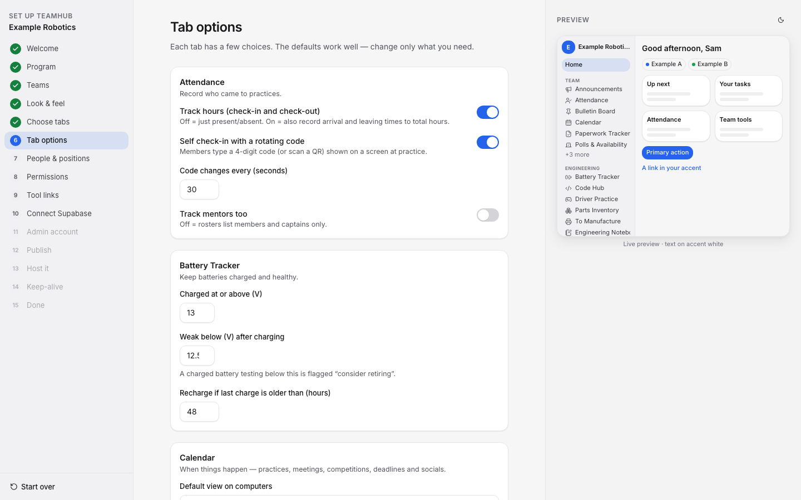
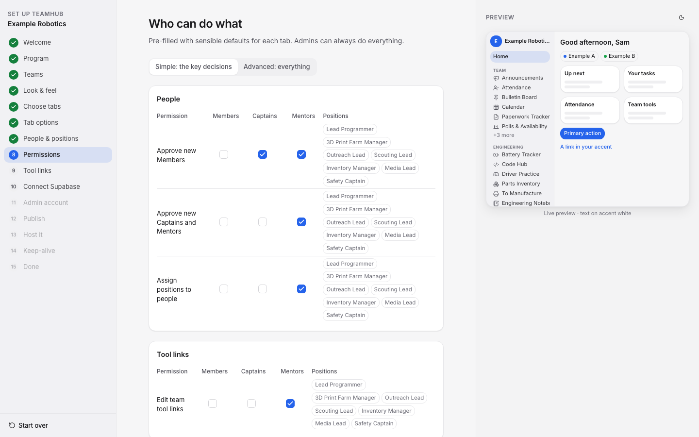
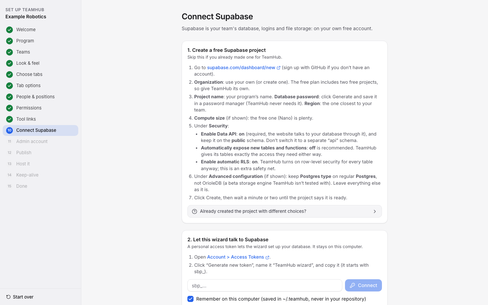
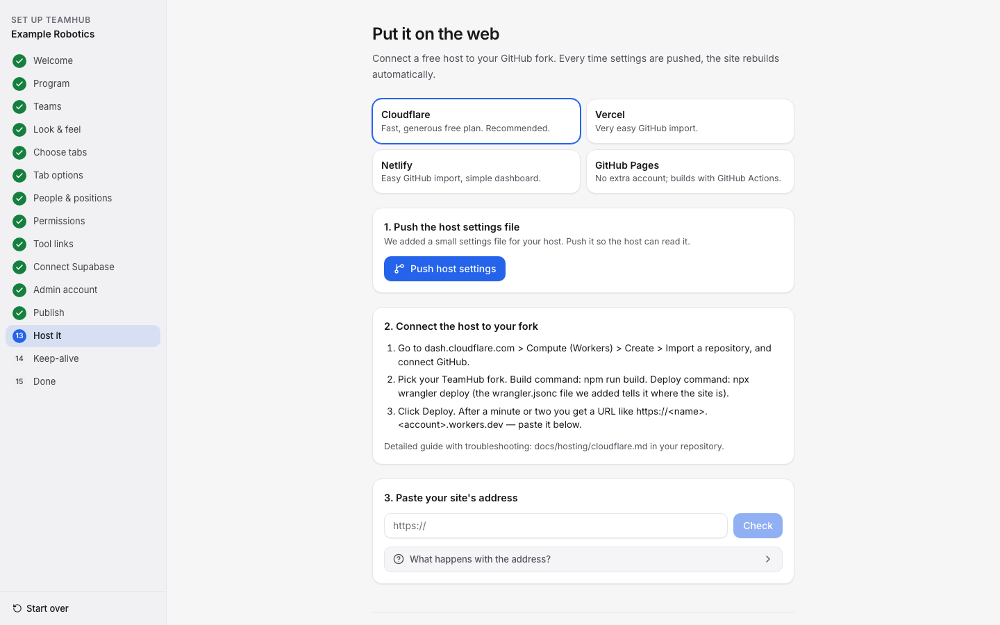

# The setup wizard

Run `npm run setup` in your copy of TeamHub and the wizard opens at `http://localhost:4747`. It runs only on your
computer, saves your progress as you go (you can quit and come back), and shows a live preview of your dashboard on
wide screens. Plan on about 30 minutes.

## Before you start: get your own copy

TeamHub runs from **your own copy** of the code on GitHub (a "fork"). Your team's settings are saved there, your
website is built from it, and TeamHub updates are merged into it.

1. Sign in to [GitHub](https://github.com) (create a free account if you need one).
2. Open [github.com/elikorpus/teamhub-ftc](https://github.com/elikorpus/teamhub-ftc) and click **Fork** (top right).
3. On the "Create a new fork" page:
   - **Owner:** pick your team's or school's GitHub organization if you have one (so other mentors and captains can
     help manage it), otherwise your own account.
   - **Repository name:** name it after your team or organization, ending in `-teamhub`. See the naming suggestions
     below.
   - Click **Create fork**.
4. Copy your fork's address: on your fork's page, click the green **Code** button and copy the HTTPS link.
5. Download it to your computer, in a terminal:

   ```sh
   git clone https://github.com/OWNER/REPOSITORY-NAME.git
   cd REPOSITORY-NAME
   npm install
   npm run setup
   ```

### Naming your copy

We suggest **`<your team or organization>-teamhub`**, in lowercase with hyphens. It makes your copy easy to spot
among your repositories, tells people what it is at a glance, and gives a tidy address if you host on GitHub Pages.

| Your program | Suggested repository name |
|---|---|
| A school club with several teams, "Example Robotics" | `example-robotics-teamhub` |
| A single team, #12345 "Gear Grinders" | `gear-grinders-teamhub` or `team-12345-teamhub` |
| An organization's account, "Example High School" | `example-hs-robotics-teamhub` |

**What goes in the clone address:** `OWNER` is the account you forked to (your GitHub username, or your
organization's name), and `REPOSITORY-NAME` is the name you chose. For example, Example Robotics forking to its
organization would run:

```sh
git clone https://github.com/example-robotics/example-robotics-teamhub.git
cd example-robotics-teamhub
```

Already forked with the default name `teamhub-ftc`? That works fine. Nothing in TeamHub depends on the repository or
folder name, so you can rename it on GitHub any time (your fork's **Settings > General > Repository name**). GitHub
redirects the old address, so your copy keeps working. One exception: if you host on **GitHub Pages**, your site's
address includes the repository name, so after renaming, run `npm run setup` > Edit > **Host it** and paste the new
address.

**Prefer not to use a terminal for this?** In [GitHub Desktop](https://desktop.github.com), choose **File > Clone
repository**, pick your fork from the list, then open a terminal in that folder (**Repository > Open in Terminal**)
and run `npm install` and `npm run setup`.

Clone **your fork**, not `elikorpus/teamhub-ftc` itself: the wizard needs to save your settings to a copy you own.
If you cloned the original by mistake, fork it on GitHub and clone your fork instead. (If you have the GitHub
command-line tool `gh` installed and signed in, the wizard's Publish step can create the fork for you.)

## 1. Welcome

What you'll need: a GitHub account, a free Supabase account, and about 30 minutes. Everything runs on free plans.



## 2–3. Program and teams

Name your program, then add each team. Type an FTC team number and the wizard fills in the team's name from
FTCScout. Each team gets a short code (A, B, …) and a color that marks its items everywhere in the dashboard.

The program logo (or, without one, the first team's logo) also becomes the browser-tab icon, the phone home-screen
icon and the **link preview**: the picture, name and description that Discord, iMessage, Slack, WhatsApp and social
media show when someone shares your site's link. Without any logo, link previews show a TeamHub picture.



## 4. Look & feel

Pick an accent color (it's automatically adjusted so text stays readable in light and dark mode), the corner style,
the default theme and the season label.



## 5. Choose tabs

Pick only what your team will use. Presets get you started (**Starter**, **Competitive**, **Everything**), and each
card says what the tab is for, what it stores and roughly how much space it uses. You can add or remove tabs later
without losing data.



## 6. Tab options

A few choices per tab, such as whether Attendance tracks hours or allows self check-in. The defaults work well.



## 7–8. People, positions and permissions

Set up subteams, positions (like "3D Print Farm Manager" or "Outreach Lead") and extra profile fields. Then decide who
can do what. The **Simple** view shows only the key decisions for each tab; **Advanced** shows everything. Admins can
always do everything.



## 9. Team tools

Your team chat, Drive folder, CAD, code repository and other links. Tabs use them to point people to the right place
(for example "Discuss in Discord" under a poll). After setup, they're edited on the dashboard's **Links** page.

## 10. Connect Supabase

Create a free Supabase project, then paste a personal access token. When creating the project:

| Option | Choose |
|---|---|
| Organization | Your own. The free plan includes two free projects, so give TeamHub its own. |
| Project name, region | Your program's name; the region closest to your team. |
| Database password | Generate one and save it in a password manager. TeamHub never needs it. |
| Compute size | The free one (Nano). |
| Enable Data API | **On**, serving the **public** schema (required). |
| Automatically expose new tables and functions | **Off** (recommended). TeamHub grants its own access either way. |
| Enable automatic RLS | **On**. An extra safety net; TeamHub enables row-level security on every table anyway. |
| Postgres type (Advanced) | Regular **Postgres**, not OrioleDB. |

After you pick the project, the wizard checks that the Data API serves the public schema and offers to fix it. It
shows exactly what it will create, builds your database for only the tabs you picked, and finally tests that your
website will be able to reach it. The token stays on your computer.

### The access token: how long it lasts and how to replace it

Make the token at [Account > Access Tokens](https://supabase.com/dashboard/account/tokens) > **Generate new token**.
Name it "TeamHub wizard" and set **Expires in** to **30 days**. Don't choose "Never": the token can change everything
in your Supabase account, so a short one is safer if your computer is lost or shared. If you'll make changes all
season, a custom date up to a year is fine. Supabase shows the token only once (it starts with `sbp_`).

Only the wizard uses the token. Your website, logins and data never do, so nothing breaks when it expires. When it
does, the wizard forgets it and the home screen says "Your Supabase access token has expired". To replace it:

1. Make a new token with the same steps.
2. In the wizard home, click **Connect** and paste it.
3. Delete the old token in Account > Access Tokens.

You can delete the token any time to stop the wizard having access, and make a new one when you next need it.



## 11–12. Admin account and publish

Create your own admin login, then save your settings to your GitHub copy of TeamHub.

## 13. Host it

Choose Cloudflare, Vercel, Netlify or GitHub Pages and follow the three short steps. Paste your site's address at the
end and the wizard points Supabase logins at it. Detailed guides: [hosting](hosting/README.md).



## 14–15. Keep-alive and done

The wizard adds a small GitHub workflow that keeps your free Supabase project from pausing, then gives you a join link,
a printable "How to join" page with a QR code, and a ready-to-paste prompt for customizing the code with an AI
assistant (see [AGENTS.md](../AGENTS.md)).

## Running it again later

Run `npm run setup` any time. Once setup is complete, the wizard always opens on its home screen (an edit you didn't
finish is offered there, with **Continue editing** or **Discard**). The home screen has:

- **Edit**: change tabs, branding or permissions. It shows a summary of the changes and backs up any tab you remove
  before touching the database.
- **Update**: apply database updates after you sync your copy with the latest TeamHub.
- **Email**: connect an email provider (SMTP) and turn on email confirmation and "Forgot your password?". See
  [email.md](email.md).
- **Backup & Export**, **New Season**, and a **Danger zone** for removing TeamHub entirely.
- Links to your dashboard, your Supabase project and your GitHub copy; the invite message with its QR code and
  printable "How to join" page; the AI assistant prompt; and the optional "tell us you're using TeamHub" form.

When **Edit > Review & apply** finishes all three steps, a green "All done" message confirms it worked, with a
**Back to wizard home** button below it. Going back to wizard home only asks you to discard edits when some changes
haven't been applied yet.
